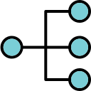
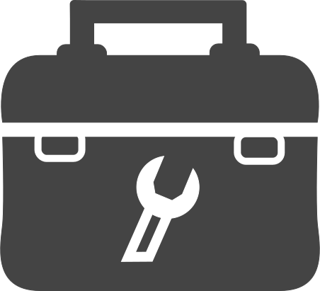
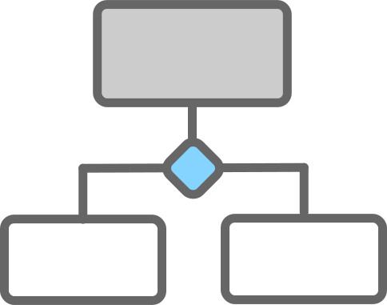
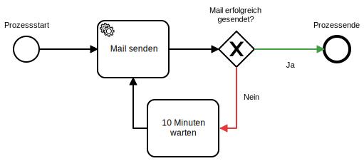

layout: true
class: content
background-image: url(img/office_2_bright.jpg)

---

class: center, middle, whiteFont
background-image: url(img/gears.jpg)

# ProcessEngineJS
Demo einer verteilten Typescript Process Engine
???
- Unser unternehmen, die PottJS GmbH
- Konnte vor 3 Monaten einen super Auftrag an Land ziehen

---

.left_half.center[

]
.right_half[
.speech[
Lorem ipsum dolor sit amet, consetetur sadipscing elitr, sed diam nonumy eirmod tempor invidunt ut labore et dolore magna aliquyam erat, sed diam voluptua. At vero eos et accusam et justo duo dolores et ea rebum. Stet clita kasd gubergren, no sea takimata sanctus est Lorem ipsum dolor sit amet. Lorem ipsum dolor sit amet, consetetur sadipscing elitr, sed diam nonumy eirmod tempor invidunt ut labore et dolore magna aliquyam erat, sed diam voluptua. At vero eos et accusam et justo duo dolores et ea rebum. Stet clita kasd gubergren, no sea takimata sanctus est Lorem ipsum dolor sit amet. Lorem ipsum dolor sit amet, consetetur sadipscing elitr, sed diam nonumy eirmod tempor invidunt ut labore et dolore magna aliquyam erat, sed diam voluptua. At vero eos et accusam et justo duo dolores et ea rebum. Stet clita kasd gubergren, no sea takimata sanctus est Lorem ipsum dolor sit amet.   

Duis autem vel eum iriure dolor in hendrerit in vulputate velit esse molestie consequat, vel illum dolore eu feugiat nulla facilisis at vero eros et accumsan et iusto odio dignissim qui blandit praesent luptatum zzril delenit augue duis dolore te feugait nulla facilisi. Lorem ipsum dolor sit amet, consectetuer adipiscing elit, sed diam nonummy nibh euismod tincidunt ut laoreet dolore magna aliquam erat volutpat.   

Ut wisi enim ad minim veniam, quis nostrud exerci tation ullamcorper suscipit lobortis nisl ut aliquip ex ea commodo consequat. Duis autem vel eum iriure dolor in hendrerit in vulputate velit esse molestie consequat, vel illum dolore eu feugiat nulla facilisis at vero eros et accumsan et iusto odio dignissim qui blandit praesent luptatum zzril delenit augue duis dolore te feugait nulla facilisi.   

Nam liber tempor cum soluta nobis eleifend option congue nihil imperdiet doming id quod mazim placerat facer possim assum. Lorem ipsum dolor sit amet, consectetuer adipiscing elit, sed diam nonummy nibh euismod tincidunt ut laoreet dolore magna aliquam erat volutpat. Ut wisi enim ad minim veniam, quis nostrud exerci tation ullamcorper suscipit lobortis nisl ut aliquip ex ea commodo consequat.   

Duis autem vel eum iriure dolor in hendrerit in vulputate velit esse molestie consequat, vel illum dolore eu feugiat nulla facilisis.
]]
???
- Kunde hat uns in langen meetings seine Anforderungen dargelegt
- Wir direkt: Jo, machen wir

---

.left_half[
.speech_own[
### IoC
### Clean code
### Microservices
### Single-Responsibility
### Schichtenarchitektur
### Test-driven development
### Continuous Deployment
]]
.right_half.center[

]
???
- Nach allen Regeln der Kunst

---

class: middle
.left_half.center[

]
.right_half.center[

]
???
- Kunde nicht _wirklich_ zufrieden
- Details passen nicht
- Anforderungen nicht genau beachtet
- Anforderungen mittlerweile geändert
- Funktionalität nicht _ganz_ vollständig
- Warum?

---

class: middle
.left_half[
.left_half[]
.right_half[.speech[
Lorem ipsum dolor sit amet, consetetur sadipscing elitr, sed diam nonumy eirmod tempor invidunt ut labore et dolore magna aliquyam erat, sed diam voluptua. At vero eos et accusam et justo duo dolores et ea rebum. Stet clita kasd gubergren, no sea takimata sanctus est Lorem ipsum dolor sit amet. Lorem ipsum dolor sit amet, consetetur sadipscing elitr, sed diam nonumy eirmod tempor invidunt ut labore et dolore magna aliquyam erat, sed diam voluptua. At vero eos et accusam et justo duo dolores et ea rebum. Stet clita kasd gubergren, no sea takimata sanctus est Lorem ipsum dolor sit amet. Lorem ipsum dolor sit amet, consetetur sadipscing elitr, sed diam nonumy eirmod tempor invidunt ut labore et dolore magna aliquyam erat, sed diam voluptua. At vero eos et accusam et justo duo dolores et ea rebum. Stet clita kasd gubergren, no sea takimata sanctus est Lorem ipsum dolor sit amet.   

Duis autem vel eum iriure dolor in hendrerit in vulputate velit esse molestie consequat, vel illum dolore eu feugiat nulla facilisis at vero eros et accumsan et iusto odio dignissim qui blandit praesent luptatum zzril delenit augue duis dolore te feugait nulla facilisi.
]]
]
.right_half.left[

]
???
- Umsetzung der Kundenanforderungen passiert genau da
- Ist im kompletten code verteilt, nicht einsehbar

---

class: top
.center[]
.left_half.center[
.left_half[

]
.right_half[
.speech[

]
]
]
.right_half.center[
.right_half[

]
.left_half[
.speech_own[

]
]
]
???
- Sprechen unterschiedliche sprachen
- Fachlich vs technisch
- prosa vs code

---

class: top
.center[]
.left_half.center[
.left_half[

]
.right_half[
.speech[

]
]
]
.right_half.center[
.right_half[

]
.left_half[
.speech_own[

]
]
]
???
- Die gleiche Sprache sprechen (BPMN)
- Realisiert durch Process Engine
- Zusammensetzen und gemeinsam am Prozess arbeiten
- Viele Kunden haben bereits dutzende Prozessdiagramme
- Prozess kann z.B. so aussehen

---

background-image: url(img/chart_background_2.jpg)

???
- Einzelne Prozesselemente erklären
- Prozesse werden auch etwas größer

---

background-image: url(img/reservation.svg)
background-size: contain
???
- Ist einfacher Automiet-prozess

---

class: blackFont
background-image: url(img/chart_background_2.jpg)
# .center[Warum lohnt es sich so zu arbeiten?]

.center[#### Das Programm betrachten]

.center[ohne den Code zu sehen]

.center[#### Das Programm verstehen]

.center[ohne Quelltext zu durchsuchen]

***
***
#### .center[Die Fachliche Implementierung wird durch Software gestützt, statt in ihr vergraben]
#### .center[Das Modell ist Doku und Bestandteil zugleich, und kann auch mit nicht-nerds besprochen werden]
???
- zusammengefasst: Trennung von fachlicher und technischer Implementierung
- Programm betrachten, ohne code zu sehen
- Programm verstehen, ohne Quelltext zu durchsuchen
- Programmablauf anpassen, ohne Code anzufassen
- Fachliche Implementierung gestützt, statt vergraben
- Modell = Doku und Bestandteil, auch für nicht-nerds
TODO: Besseres "Verstehen"-Foto finden (close-up?)

---

background-image: url(img/retourenprozess.svg)
background-size: contain
class: center, middle
# .center[TODO: Brauerei-Retourenprozess einfügen]
???
- Ist Retourenprozess einer Brauerei
- Ist echter Prozess der tatsächlich in verwendung ist
- Kunde versteht den Prozess
- Den will man nicht in Code vergraben haben
- Modelle existierten schon vor Software
- TODO: Den großen Retourenprozess einbetten

---

background-image: url(img/reservation.svg)
background-size: contain
???
- Prozess einmal genau durchgehen

---

class: center, middle, blackFont
background-image: url(img/chart_background_2.jpg)
# .center[Demo-Zeit!]
???
- Erster durchgang: Es geht
- Zweiter durchgang: Änderung direkt angewendet -> kein Codegenerator
- ggf. dritter durchgang: Tokendetails (zeigen, wo er lang gelaufen ist)
- TODO: Demo vorbereiten

---

class: center, middle, blackFont
background-image: url(img/collaborate_bright.jpg)
## Eine ProcessEngine verbindet die vorteile beider Welten
Eine direkte einbindung der Fachlichen Prozesse

Basierend auf der technischen Umsetzung eines modernen Stacks
???
- Code kann in sauberem Stack geschrieben werden, und der Prozess direkt integriert werden

---

class: middle, blackFont
background-image: url(img/collaborate_bright.jpg)
## Die ProcessEngineJS
Auf Typescript basierendes Framework zum erstellen eigener, verteilter ProcessEngines!
- Typescript
- Node/Browser
- IoC
- Microservices
- Schichtenarchitektur

***

Vorteile gegenüber anderer ProcessEngines:
- Basiert auf JavaScript
- Erstellen eigener Services und Entities
- Anbinden externer Services und Schnittstellen
- Deployen auf verschiedenen Plattformen
- Verteilte Ausführung
- Selbst entwickelt -> für die eigenen Bedürfnisse angepasst

---

class: center, middle, blackFont
background-image: url(img/collaborate_bright.jpg)
# ... Fragen?
