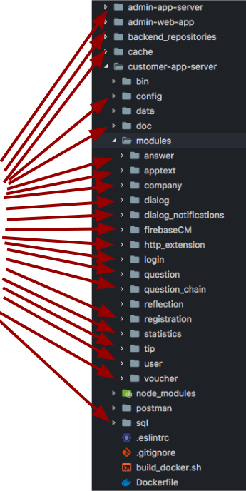

layout: true
class: content
background-image: url(img/office_2_bright.jpg)

---

class: center, middle, whiteFont
background-image: url(img/gears.jpg)

# ProcessEngineJS
Demo einer verteilten TypeScript Process Engine
???
- Ich will ein kleines Rollenspiel mit euch machen
- Unser unternehmen, die PottJS GmbH
- Konnte vor 3 Monaten einen super Auftrag an Land ziehen

---

.left_half.center[

]
.right_half[
.speech[
Lorem ipsum dolor sit amet, consetetur sadipscing elitr, sed diam nonumy eirmod tempor invidunt ut labore et dolore magna aliquyam erat, sed diam voluptua. At vero eos et accusam et justo duo dolores et ea rebum. Stet clita kasd gubergren, no sea takimata sanctus est Lorem ipsum dolor sit amet. Lorem ipsum dolor sit amet, consetetur sadipscing elitr, sed diam nonumy eirmod tempor invidunt ut labore et dolore magna aliquyam erat, sed diam voluptua. At vero eos et accusam et justo duo dolores et ea rebum. Stet clita kasd gubergren, no sea takimata sanctus est Lorem ipsum dolor sit amet. Lorem ipsum dolor sit amet, consetetur sadipscing elitr, sed diam nonumy eirmod tempor invidunt ut labore et dolore magna aliquyam erat, sed diam voluptua. At vero eos et accusam et justo duo dolores et ea rebum. Stet clita kasd gubergren, no sea takimata sanctus est Lorem ipsum dolor sit amet.   

Duis autem vel eum iriure dolor in hendrerit in vulputate velit esse molestie consequat, vel illum dolore eu feugiat nulla facilisis at vero eros et accumsan et iusto odio dignissim qui blandit praesent luptatum zzril delenit augue duis dolore te feugait nulla facilisi. Lorem ipsum dolor sit amet, consectetuer adipiscing elit, sed diam nonummy nibh euismod tincidunt ut laoreet dolore magna aliquam erat volutpat.   

Ut wisi enim ad minim veniam, quis nostrud exerci tation ullamcorper suscipit lobortis nisl ut aliquip ex ea commodo consequat. Duis autem vel eum iriure dolor in hendrerit in vulputate velit esse molestie consequat, vel illum dolore eu feugiat nulla facilisis at vero eros et accumsan et iusto odio dignissim qui blandit praesent luptatum zzril delenit augue duis dolore te feugait nulla facilisi.   

Nam liber tempor cum soluta nobis eleifend option congue nihil imperdiet doming id quod mazim placerat facer possim assum. Lorem ipsum dolor sit amet, consectetuer adipiscing elit, sed diam nonummy nibh euismod tincidunt ut laoreet dolore magna aliquam erat volutpat. Ut wisi enim ad minim veniam, quis nostrud exerci tation ullamcorper suscipit lobortis nisl ut aliquip ex ea commodo consequat.   

Duis autem vel eum iriure dolor in hendrerit in vulputate velit esse molestie consequat, vel illum dolore eu feugiat nulla facilisis.
]]
???
- Kunde hat uns in langen meetings seine Anforderungen dargelegt
- Wir direkt: Jo, machen wir

---

.left_half[
.speech_own[
### IoC
### Clean code
### Microservices
### Single-Responsibility
### Schichtenarchitektur
### Test-driven development
### Continuous Deployment
]]
.right_half.center[

]
???
- Nach allen Regeln der Kunst

---

class: middle
.left_half.center[

]
.right_half.center[

]
???
- Seht euch den kunden an: unzufrieden bei shiny app
- Warum?

---

class: middle
.left_half[
.left_half[]
.right_half[.speech[
Lorem ipsum dolor sit amet, consetetur sadipscing elitr, sed diam nonumy eirmod tempor invidunt ut labore et dolore magna aliquyam erat, sed diam voluptua. At vero eos et accusam et justo duo dolores et ea rebum. Stet clita kasd gubergren, no sea takimata sanctus est Lorem ipsum dolor sit amet. Lorem ipsum dolor sit amet, consetetur sadipscing elitr, sed diam nonumy eirmod tempor invidunt ut labore et dolore magna aliquyam erat, sed diam voluptua. At vero eos et accusam et justo duo dolores et ea rebum. Stet clita kasd gubergren, no sea takimata sanctus est Lorem ipsum dolor sit amet. Lorem ipsum dolor sit amet, consetetur sadipscing elitr, sed diam nonumy eirmod tempor invidunt ut labore et dolore magna aliquyam erat, sed diam voluptua. At vero eos et accusam et justo duo dolores et ea rebum. Stet clita kasd gubergren, no sea takimata sanctus est Lorem ipsum dolor sit amet.   

Duis autem vel eum iriure dolor in hendrerit in vulputate velit esse molestie consequat, vel illum dolore eu feugiat nulla facilisis at vero eros et accumsan et iusto odio dignissim qui blandit praesent luptatum zzril delenit augue duis dolore te feugait nulla facilisi.
]]
]
.right_half.left[

]
???
- Umsetzung der Kundenanforderungen passiert genau da
- Ist im kompletten code verteilt, nicht einsehbar

---

class: top
.center[]
.left_half.center[
.left_half[

]
.right_half[
.speech[

]
]
]
.right_half.center[
.right_half[

]
.left_half[
.speech_own[

]
]
]
???
- Sprechen unterschiedliche sprachen
- Fachlich vs technisch
- prosa vs code

---

class: top
.center[]
.left_half.center[
.left_half[

]
.right_half[
.speech[

]
]
]
.right_half.center[
.right_half[

]
.left_half[
.speech_own[

]
]
]
.center[# BPMN]
.center[### Business Process Model and Notation]
???
- Die gleiche Sprache sprechen (BPMN)
- Realisiert durch Process Engine
- Zusammensetzen und gemeinsam am Prozess arbeiten
- Viele Kunden haben bereits dutzende Prozessdiagramme
- einfacher Prozess kann so aussehen

---

class: middle
background-image: none

???
- Einzelne Prozesselemente erklären
- Prozesse werden auch etwas größer

---

background-image: url(img/create_claim.svg)
background-size: contain
???
- Ist Retourenprozess einer Brauerei
- Ist echter Prozess der tatsächlich in verwendung ist
- Kunde versteht den Prozess
- Den will man nicht in Code vergraben haben
- Modelle existierten schon vor Software
- TODO: Den großen Retourenprozess einbetten

---

class: center, blackFont
background-image: url(img/chart_background_2.jpg)
background-size: cover
# .center[Warum lohnt es sich, so zu arbeiten?]

.center[#### Das Programm betrachten]
.center[ohne den Code zu sehen]

---

class: center, blackFont
background-image: url(img/chart_background_2.jpg)
background-size: cover
# .center[Warum lohnt es sich, so zu arbeiten?]

.center[#### Das Programm verstehen]
.center[ohne Quelltext zu durchsuchen]

---

class: center, blackFont
background-image: url(img/reservation_bright_2.png)
background-size: contain
# .center[Warum lohnt es sich, so zu arbeiten?]

#### .center[Die fachliche Implementierung ist nicht im Code vergraben!]

#### .center[Das Modell ist Doku und Bestandteil zugleich!]
???
- fachliche Implementierung nicht im Code vergraben
- "Überlegt mal, Das Modell ist Doku und Bestandteil zu gleich, kann auch mit nicht-nerds besproche werden"

---

background-image: url(img/reservation.png)
background-size: contain
???
- Prozess einmal genau durchgehen

---

class: middle, blackFont
background-image: url(img/collaborate_bright.jpg)
## Die ProcessEngineJS
Auf TypeScript basierendes Framework zum Erstellen eigener, verteilter ProcessEngines!
- Typescript
- Node/Browser
- IoC
- Micro Services
- Schichtenarchitektur

***

Vorteile gegenüber anderen ProcessEngines:
- Basiert auf JavaScript
- Erstellen eigener Services und Entities
- Anbinden externer Services und Schnittstellen
- Deployen auf verschiedenen Plattformen
- Verteilte Ausführung
- Selbst entwickelt -> für die eigenen Bedürfnisse angepasst

---

class: center, middle, blackFont
background-image: url(img/collaborate_bright.jpg)
## Eine ProcessEngine verbindet die Vorteile beider Welten
eine direkte Einbindung der fachlichen Prozesse

basierend auf der technischen Umsetzung eines modernen Stacks
???
- Code kann in sauberem Stack geschrieben werden, und der Prozess direkt integriert werden

---

class: center, middle, blackFont
background-image: url(img/collaborate_bright.jpg)
# Vielen Dank an

.left_half.center[
## QUANTUSflow Software GmbH
]

.right_half.center[
## Huf Secure Mobile GmbH
]
???
- Code kann in sauberem Stack geschrieben werden, und der Prozess direkt integriert werden
